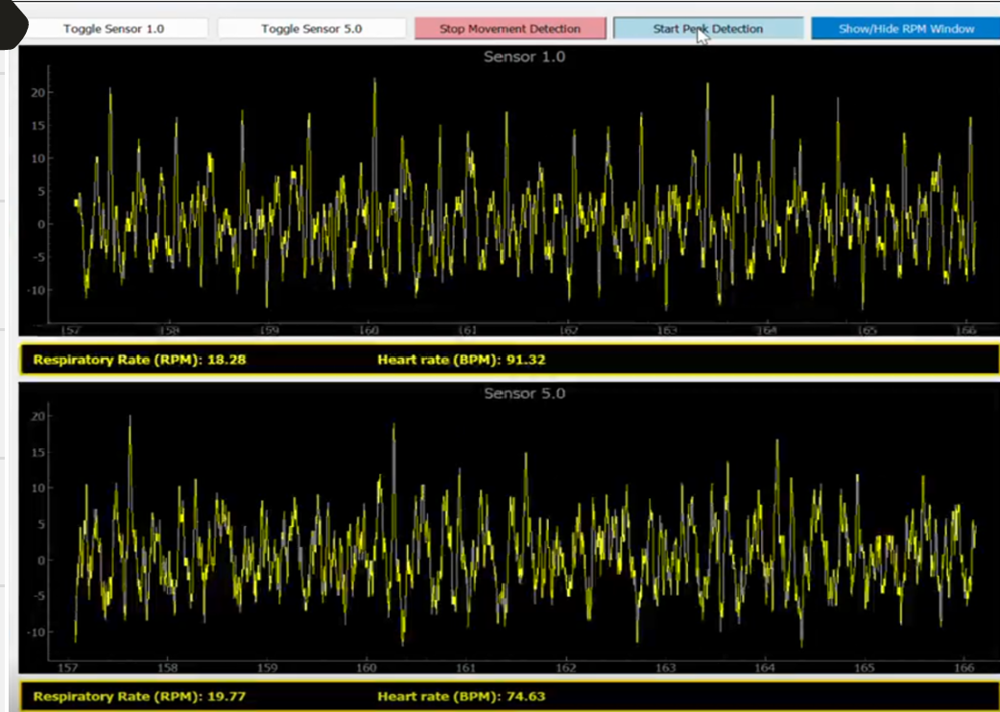

# Bio_Monitoring
Implémentation d'un affichage en temps réel des signaux physiologiques : rythme cardiaque, respiration et activité motrice.
L'implémentation doit être liée à un Capteur et extracteur de données. Implémentation sous python et utilisation de la bilibiothèque PyQtgraph.

## Apercu de l'affichage

Différents boutons permettent d'afficher la détection des données physiologiques afficher au cours du temps en seconde. Les signaux proviennent de plusieurs capteurs de vibrations mécaniques.

